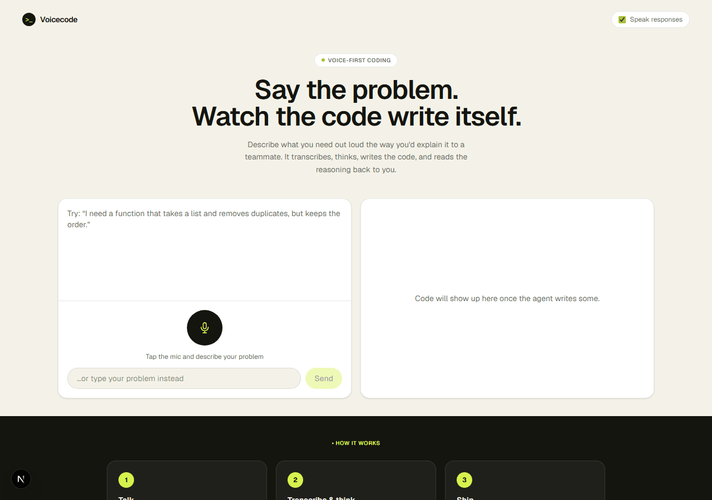
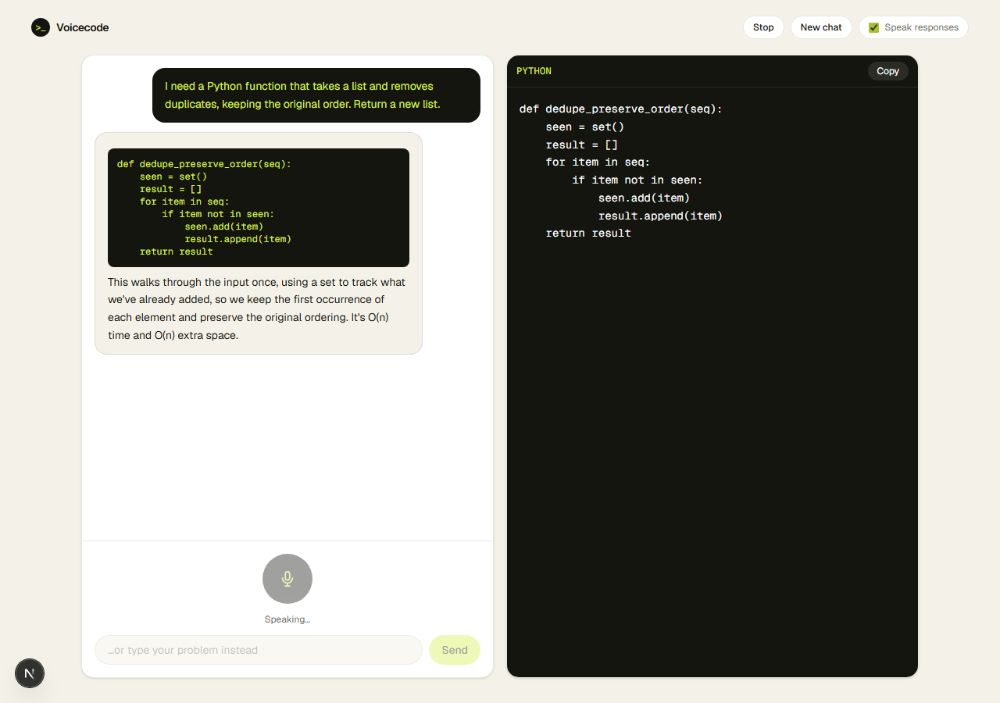

<div align="center">

# Voice Pair Programmer

[](https://git.io/typing-svg)

[](https://nextjs.org/)
[](https://react.dev/)
[](./src/lib/parseMessage.test.ts)
[](https://console.groq.com/)

</div>

Describe a coding problem out loud, the way you'd explain it to a teammate sitting next to
you. It transcribes what you said, thinks through it, writes real code, and reads the
explanation back to you — a voice-first pair-programming session instead of a typing one.

## Demo

A real run: type (or speak) a problem, the model asks a clarifying question if something's
ambiguous — it doesn't guess — then once it has enough, writes working code with a short
spoken-style explanation, streamed into the code panel on the right.



<details>
<summary>Full page screenshot</summary>



</details>

## How it works

```
mic press  ──►  MediaRecorder captures audio
                        │
                        ▼
              Groq Whisper (whisper-large-v3-turbo) transcribes it
                        │
                        ▼
              Groq chat model reasons about the problem —
              asks ONE clarifying question if something's missing,
              otherwise writes the code
                        │
                        ▼
              Code streams into the right-hand panel;
              the spoken-style explanation is read back
              with the browser's SpeechSynthesis API
```

- **Speech in**: `MediaRecorder` + `getUserMedia` capture the mic, sent to `/api/transcribe`
  which forwards to Groq's Whisper endpoint. No client-side speech recognition — the actual
  audio is transcribed server-side.
- **Speech out**: the browser's native `SpeechSynthesis` API reads the explanation back
  (toggleable via "Speak responses") — no extra TTS service or API cost.
- **Text fallback**: typing works identically to speaking — same `/api/chat` pipeline, useful
  when you'd rather not use a mic (or for this demo, since it's screenshot-friendly).
- **Model resilience**: `src/lib/groq.ts` defines a primary chat model and a separate
  fallback model with its own daily quota, so a 429 on the primary doesn't end the session.

## Setup

```bash
npm install
cp .env.local.example .env.local   # add your GROQ_API_KEY
npm run dev
```

Open [http://localhost:3000](http://localhost:3000).

## Testing

```bash
npm test
```

Unit tests cover `parseMessage.ts` — the logic that splits a model response into the
fenced code block (routed to the code panel) and the surrounding spoken-style explanation
(routed to the chat + TTS).

## Project structure

```
src/app/
  page.tsx                main UI: chat pane, code panel, mic/text input
  api/chat/route.ts        Groq chat completion (system prompt: ask-then-code)
  api/transcribe/route.ts  Groq Whisper transcription endpoint
src/components/
  CodePanel.tsx            syntax-highlighted code panel with copy button
  MessageBubble.tsx         chat message rendering
src/lib/
  groq.ts                   Groq API base, model config, API key handling
  parseMessage.ts            splits a response into code block + explanation
  parseMessage.test.ts        vitest suite for the above
```
